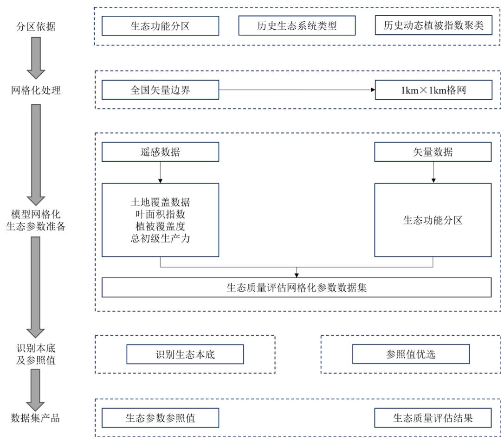
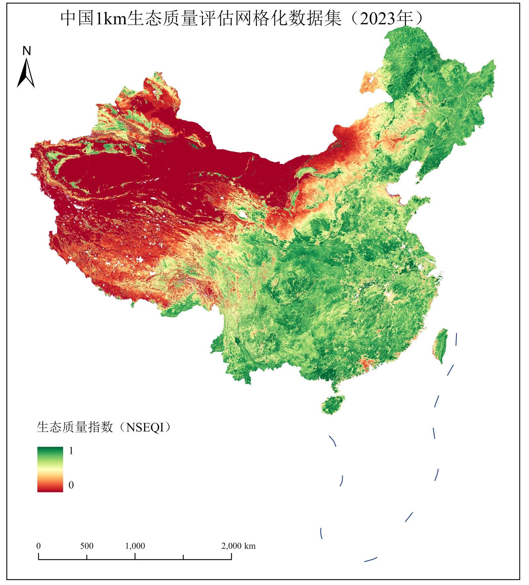

# China 1-km Gridded Ecological Quality Assessment Dataset for 2023

[中文](README.md) | **English**

2023 · China · 1 km × 1 km · GeoTIFF · Dimensionless index

## Overview

This ecological quality assessment dataset was produced by Professor Zhuowei Hu's research group at Capital Normal University under Task 3 (2023YFF1303703) of the National Key Research and Development Program of China project “Intelligent Big Data Mining Technologies for Large-Scale Ecological Quality and Ecosystem Service Assessment and the Development and Demonstration of a Gridded Key-Parameter Platform.”

The dataset provides an ecological quality index (NSEQI) for China in 2023 on a 1-km grid. It uses an assessment method based on dynamic zoning and a stable ecological baseline, integrating leaf area index (LAI), fractional vegetation cover (FVC), gross primary productivity (GPP), and historical land cover data.

The dataset **can be used for** national and regional analyses of ecological quality patterns, ecological conservation and restoration research, and assessment of ecological quality conditions in typical ecologically vulnerable regions. Combined with land use, protected area, and other local data, it can also support research on land use planning, identification of priority areas for ecological conservation and restoration, and ecological security patterns.

## Dataset information

| Item | Description |
| --- | --- |
| Year | 2023 (single year) |
| Spatial coverage | China at the national scale; actual coverage is defined by valid pixels |
| Spatial resolution | 1000 m × 1000 m |
| Variable and unit | Ecological quality index (NSEQI), dimensionless |
| Format | GeoTIFF |
| Data file | `China_Ecological_Quality_Index_2023_1km.tif` |
| File size | 33,685,674 bytes, approximately 32.13 MiB |
| Bands / data type | Single band / Float32 |
| Raster dimensions | 4833 columns × 5515 rows |
| Coordinate reference system | Custom Albers Equal Area Conic projection based on WGS 84; coordinates in metres |
| Projection parameters | Central meridian: 105°; latitude of origin: 0°; standard parallels: 25° and 47°; false easting and false northing: 0 m |
| XY coordinate system | Albers_Conic_Equal_Area |
| NoData | `-9999` |
| Valid pixel range | 0–1 |
| Valid pixel count | 9,376,796 (excluding NoData) |
| Compression | LZW |
| Producing institution | Capital Normal University |
| Version | v1.0.0 |

Full spatial information is provided in the [metadata file](metadata/dataset_metadata.json) and [projection WKT](metadata/crs.wkt). Exclude NoData when reading or summarizing the raster. Zero is a valid value and must not be removed as missing data.

## Download

Download `China_Ecological_Quality_Index_2023_1km.tif` and `SHA256SUMS.txt` from [**Releases**](https://github.com/giserwx/ChinaEcologicalQuality-1km-2023/releases). GitHub's “Download ZIP” contains documentation, metadata, figures, and the reading example, but does not include the national GeoTIFF.

Verify file integrity using `sha256sum China_Ecological_Quality_Index_2023_1km.tif` (Linux/macOS) or `Get-FileHash China_Ecological_Quality_Index_2023_1km.tif -Algorithm SHA256` (PowerShell).

## Methods

The dataset integrates multi-period LAI, FVC, and GPP data for China with land cover data for 2000–2023 (MODIS MCD12Q1), using an ecological quality assessment method that combines dynamic zoning with a stable ecological baseline.

1. **Construct dynamic assessment units.** Integrate national ecological functional zoning with dynamic ecosystem types to define assessment units.
2. **Identify candidate stable baseline areas.** Select areas with consistent historical ecosystem types within each assessment unit.
3. **Select a high-functioning, stable baseline.** Apply two thresholds—a multi-year mean above the 90th percentile and a coefficient of variation below the 10th percentile—to identify the historical stable ecological baseline.
4. **Select reference values and assess ecological quality.** Use the 99th percentile of the ecological index within baseline areas as the reference value to produce the 2023 assessment on a 1-km grid.



## Quality assessment

The research group compared this dataset's assessment results with results corresponding to the *Technical Specification for Investigation and Assessment of National Ecological Status—Ecosystem Quality Assessment*:

| Assessment | Result |
| --- | --- |
| Fit to the technical specification's assessment results | R² = 0.8014 |
| Fit of the comparison study's dataset to the technical specification's assessment results | R² = 0.7046 |
| Coefficient of variation (CV) | 0.565 for the technical specification's results; 0.480 for this method |
| Relative reduction in assessment uncertainty | 15% |


## Spatial distribution



## Reading the data

Open the file in GIS software that supports GeoTIFF, or install Python packages `rasterio` and `numpy` and run:

```bash
python scripts/read_geotiff.py /path/to/China_Ecological_Quality_Index_2023_1km.tif
```

This repository provides data for 2023 only. Analyses of temporal trends or restoration outcomes require comparable data from other years and relevant supporting evidence.

## Data use statement

We make our data products available to the research community as we believe that the dissemination of our data will lead to advancement in science. If you plan to use our data in a manuscript or presentation, we request that you inform us at an early stage of your work. You should ensure that your research does not significantly overlap with what we are currently working on with this product. In addition, if our data are essential to your work, or if an important result or finding depends on our data, co-authorship may be appropriate. You should inform us of your analysis and publication plans well in advance of the submission of a paper, give us an opportunity to read and intellectually contribute to the manuscript, and, if appropriate, offer co-authorship. Contact: Dr. Zhuowei Hu (huzhuowei@cnu.edu.cn).

## Contacts

| Contact | Email |
| --- | --- |
| Task lead: Dr. Zhuowei Hu (胡卓玮) | [huzhuowei@cnu.edu.cn](mailto:huzhuowei@cnu.edu.cn) |
| Technical contact: Tengxun Hu (胡腾讯) | [2240902112@cnu.edu.cn](mailto:2240902112@cnu.edu.cn) |
